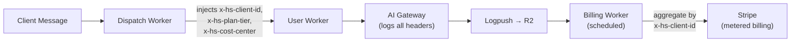

# Hardshell Platform — Resource Naming & Tagging Convention

> **STD-RES-001** — Canonical standard for all Cloudflare, git, and OpenClaw resource names.

---

## Naming Pattern

```
{project}-{environment}-{purpose}
```

| Segment | Values | Required |
|---------|--------|----------|
| `project` | `hardshell`, `contentguru`, `streamkinetics`, `govprograms` | ✅ Always |
| `environment` | `dev`, `stg`, `prod` | ✅ Always |
| `purpose` | Descriptive slug (e.g., `data`, `crm`, `aigw`, `sessions`) | ✅ Always |

**Rules:**
- All lowercase, hyphens only (no underscores, no camelCase)
- Max 63 characters (CF Worker limit)
- Environment is always the second segment
- Never abbreviate `project` — abbreviate `purpose` if length-constrained

---

## Per-Resource-Type Standards

### Cloudflare Workers

```
{project}-{env}-{purpose}
```

| Example | Description |
|---------|-------------|
| `hardshell-stg-gateway` | Hardshell staging gateway worker |
| `hardshell-prod-gateway` | Hardshell production gateway worker |
| `hardshell-prod-dispatch` | Dynamic Dispatch Worker (WfP) |
| `hardshell-prod-logpush` | Logpush processing worker |
| `hardshell-prod-monitor` | Cost monitoring scheduled worker |

**Legacy → Target Migration:**

| Current | Target | Action |
|---------|--------|--------|
| `dev-moltworker` | `hardshell-dev-gateway` | Rename when promoting |

### R2 Buckets

```
{project}-{env}-{purpose}
```

| Example | Description |
|---------|-------------|
| `hardshell-stg-data` | Staging agent data (moltbot) |
| `hardshell-prod-data` | Production agent data |
| `hardshell-prod-logs` | AI Gateway Logpush destination |
| `hardshell-prod-clients` | Per-client file storage |

**Legacy → Target:**

| Current | Target |
|---------|--------|
| `moltbot-data` | `hardshell-dev-data` |

### D1 Databases

```
{project}-{env}-{purpose}
```

| Example | Description |
|---------|-------------|
| `hardshell-stg-crm` | Staging CRM database |
| `hardshell-prod-crm` | Production CRM database |
| `hardshell-prod-platform` | Platform metadata (client records, provisioning state) |

**Legacy → Target:**

| Current | Target |
|---------|--------|
| `crm-db` | `hardshell-dev-crm` |
| `crm-db-staging` | `hardshell-stg-crm` |

### KV Namespaces

```
{project}-{env}-{purpose}
```

| Example | Description |
|---------|-------------|
| `hardshell-stg-sessions` | Staging session store |
| `hardshell-prod-sessions` | Production session store |
| `hardshell-prod-config` | Runtime configuration |

**Legacy → Target:**

| Current | Target |
|---------|--------|
| `openclaw-config` | `hardshell-dev-config` |
| `telegram-pairing` | `hardshell-dev-tg-pairing` |

### AI Gateways

```
{project}-{env}-aigw
```

| Example | Description |
|---------|-------------|
| `hardshell-stg-aigw` | Staging AI Gateway |
| `hardshell-prod-aigw` | Production AI Gateway |

**Legacy → Target:**

| Current | Target |
|---------|--------|
| `dev-moltworker-aigw` | `hardshell-dev-aigw` |
| `dev-streamkinetics-aigw` | `streamkinetics-dev-aigw` |

### Dispatch Namespaces (Workers for Platforms)

```
{project}-{env}
```

| Example | Description |
|---------|-------------|
| `hardshell-stg` | Staging dispatch namespace |
| `hardshell-prod` | Production dispatch namespace |

### User Workers (inside dispatch namespace)

```
client-{client-slug}
```

| Example | Description |
|---------|-------------|
| `client-arcane-vapes` | Arcane Vapes client worker |
| `client-segal-consulting` | Segal Consulting client worker |

> No environment prefix needed — isolation comes from the dispatch namespace itself.

---

## OpenClaw Entities

### Agent IDs

```
{role}-{name}
```

| Example | Description |
|---------|-------------|
| `omega` | Master orchestrator (exception: no prefix needed) |
| `self-intel` | Self-Intelligence / MetaMirror agent |
| `client-arcane-vapes` | Per-client agent |

### Workspaces

```
workspace-{agent-id}
```

| Example |
|---------|
| `workspace-omega` |
| `workspace-mirror` |
| `workspace-arcane-vapes` |

### Skills

```
{purpose}/SKILL.md
```

Lowercase, hyphenated directory names:

| Example | Description |
|---------|-------------|
| `discovery-pipeline/SKILL.md` | Discovery framework |
| `crm-analyst/SKILL.md` | CRM analysis |
| `zero-trust-scanner/SKILL.md` | Security scanning |
| `client-provisioner/SKILL.md` | Client provisioning automation |

---

## Git Conventions

### Branches

```
{type}/{scope}-{description}
```

| Branch | Purpose |
|--------|---------|
| `main` | Upstream tracking (cloudflare/moltworker) |
| `hardshell` | Hardshell platform branch (production-ready) |
| `feature/skills-migration` | Feature work |
| `fix/aigw-auth-header` | Bug fix |
| `release/v0.1.0` | Release candidate |

### Tags

```
v{major}.{minor}.{patch}[-{pre-release}]
```

| Tag | Meaning |
|-----|---------|
| `v0.1.0` | First stable Hardshell release |
| `v0.2.0-rc.1` | Release candidate |
| `upstream-sync-2026-02-26` | Upstream merge point marker |

---

## Tagging & Metadata Standard

Tags serve three distinct purposes across the platform. Each tier has its own schema.

### Tier 1: Infrastructure Tags (on CF Resources)

Applied to Workers, R2, D1, KV, AI Gateway resources via CF dashboard or API.

| Tag Key | Values | Purpose | Required |
|---------|--------|---------|----------|
| `platform` | `hardshell` | Identify platform-managed resources | ✅ Always |
| `env` | `dev`, `stg`, `prod` | Environment isolation | ✅ Always |
| `project` | `hardshell`, `contentguru`, `streamkinetics`, etc. | Cross-project visibility | ✅ Always |
| `cost-center` | `platform-ops`, `client-services`, `internal-rd` | Financial attribution | ✅ Always |
| `managed-by` | `provisioner`, `manual`, `ci-cd` | Track creation method | ✅ Always |
| `owner` | `joshua`, `omega`, `provisioner-skill` | Accountability | ✅ Always |
| `brand` | `contentguru`, `streamkinetics`, `metamirror`, `wealthinnovation` | Brand vertical | When applicable |
| `client` | `{client-slug}` (e.g., `arcane-vapes`) | Per-client resources | When applicable |

**Cost Center Definitions:**

| Cost Center | What It Covers |
|-------------|----------------|
| `platform-ops` | Shared infrastructure: gateway, dispatch worker, monitoring, Logpush |
| `client-services` | Per-client resources: user workers, R2 prefixes, AI token usage |
| `internal-rd` | Development, staging, testing — not billed to clients |

### Tier 2: Request-Level Metadata (AI Gateway)

Injected as custom headers or metadata on every AI Gateway request. This is how we track **per-client token spend** for billing.

| Header / Field | Value | Purpose |
|----------------|-------|---------|
| `x-hs-client-id` | `arcane-vapes` | Client attribution for cost tracking |
| `x-hs-agent-id` | `omega`, `client-arcane-vapes` | Which agent made the request |
| `x-hs-cost-center` | `client-services` | Financial bucket |
| `x-hs-brand` | `streamkinetics` | Brand vertical |
| `x-hs-session-id` | `{uuid}` | Session correlation |
| `x-hs-skill` | `discovery-pipeline` | Which skill triggered the inference |
| `x-hs-plan-tier` | `starter`, `pro`, `enterprise` | Client subscription tier (for dynamic routing) |

> [!TIP]
> These headers are logged by AI Gateway and streamed via Logpush → R2. The billing Worker parses them to calculate per-client token usage with appropriate markup by plan tier.

**Example: AI Gateway request from a client agent:**
```
POST /v1/chat/completions
x-hs-client-id: arcane-vapes
x-hs-agent-id: client-arcane-vapes
x-hs-cost-center: client-services
x-hs-brand: streamkinetics
x-hs-plan-tier: pro
x-hs-skill: crm-analyst
```

### Tier 3: Client Record (D1 — `hardshell-{env}-platform`)

Structured data in the platform database. This is the source of truth for client identity and billing.

```sql
CREATE TABLE clients (
  id            TEXT PRIMARY KEY,       -- 'arcane-vapes'
  display_name  TEXT NOT NULL,          -- 'Arcane Vapes LLC'
  brand         TEXT NOT NULL,          -- 'streamkinetics'
  plan_tier     TEXT NOT NULL,          -- 'starter' | 'pro' | 'enterprise'
  cost_center   TEXT DEFAULT 'client-services',

  -- Billing
  stripe_customer_id  TEXT,            -- 'cus_xxxxx'
  monthly_budget_usd  REAL,            -- 500.00 (AI Gateway budget limit)
  ai_markup_pct       REAL DEFAULT 0.35, -- 35% markup on token costs

  -- Provisioning
  dispatch_worker_id  TEXT,            -- 'client-arcane-vapes'
  telegram_bot_token  TEXT,            -- encrypted ref
  telegram_peer_id    TEXT,            -- 'tg:SHAWN_ID'
  r2_prefix           TEXT,            -- 'clients/arcane-vapes/'

  -- Lifecycle
  status         TEXT DEFAULT 'provisioning', -- provisioning | active | suspended | churned
  onboarded_at   TEXT,                 -- ISO timestamp
  onboarded_by   TEXT,                 -- 'joshua' | 'omega'
  discovery_id   TEXT,                 -- link to discovery record
  sow_url        TEXT,                 -- link to SOW document

  -- Audit
  created_at     TEXT DEFAULT (datetime('now')),
  updated_at     TEXT DEFAULT (datetime('now'))
);
```

### Cost Attribution Flow



**The billing Worker runs on a cron schedule and:**
1. Reads Logpush JSON from R2
2. Groups token usage by `x-hs-client-id`
3. Applies `ai_markup_pct` from the client record
4. Reports usage events to Stripe via metered billing API
5. Checks `monthly_budget_usd` — suspends clients exceeding cap

---

## Migration Strategy

> [!IMPORTANT]
> **Do not rename existing dev-moltworker resources immediately.** The naming standard applies to:
> 1. All **new** resources (hardshell-stg-*, hardshell-prod-*)
> 2. Legacy resources get renamed **only** when promoted to Hardshell production
>
> This avoids breaking the stable dev-moltworker environment.
